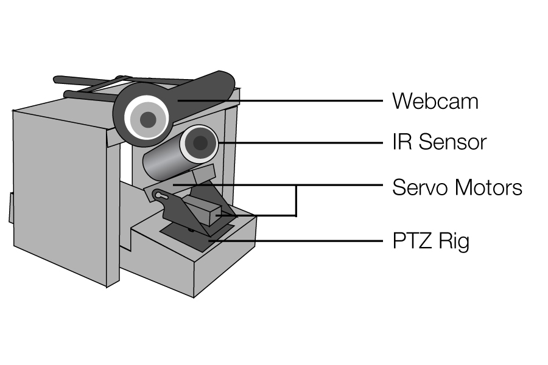

# 

*Science Fair project that received Gold at Waterloo Regional Science Fair and Silver at Canada Wide Science Fair*

ThermIS is an automated system to detect symptoms of viral infections. ThermIS passively and non-intrusively detects whether or not an individual is a possible carrier during an influenza outbreak, given that fever is a common symptom of many viruses and infections. This system can be useful in optimizing airport security, with potential applications in medicine as well.

*See the [full report](https://github.com/georgeutsin/ThermIS/blob/master/media/report.pdf) for more information.*

## Install

Used OpenCV 2.4.2 on Visual Studio C++ 2010. Just open the project in the ThermIS folder to run.

Be sure to properly set up OpenCV in Visual Studio 2010, by including the necessary PATH variables. Project works on standard OpenCV setup.
A tutorial on how to do this can be found [here](http://docs.opencv.org/2.4/doc/tutorials/introduction/windows_visual_studio_Opencv/windows_visual_studio_Opencv.html)

Also, modify SerialUtil.h to adjust to your COM port number as all communication with the hardware is through serial.

As well, install the Arduino IDE to push ThermIS_Microcontroller to your Arduino. I used an Arduino Uno. 

## Usage

Run the OpenCV application with the Arduino attached. Calibrate the IR sensor by following on screen and clicking on the laser at the predetermined points. My setup looked as folows:

Warning: Please take safety precautions when calibrating as the laser is turned on and may cause eye damage if stared into directly.

## Serial API

#### Computer to Microcontroller
##### Toggle Laser

Value: `l`
Type: `char` 

Toggles the onboard laser on/off.

##### Start Calibration

Value: `c`
Type: `char`  

Starts the calibration process which moves the servo PTZ rig to the first predetermined position and turns on the laser. Clicking on the laser dot on the computer screen automatically continues calibration. Method returns a temperature char* over serial, used in calibration.

##### Continue Calibration

Value: `n`
Type: `char`  

Command to continue calibration if calibratoin has already started. Depending on the state of the PTZ, 'n' moves the PTZ to the next state. Method returns a temperature char* over serial, used in calibration.

##### Move Servo to (X,Y)

Value: `(x,y)`
Type: `char*`  

Sending a char array (or individual characters) of `(` followed the digits of X, `,` followed by the digits of Y and `)` moves the servo PTZ rig to the specified coordinates. X and Y should be determined using the onboard calibration method which transforms pixel coordinates on screen to coordinates on the PTZ rig. Method returns a temperature char* over serial, which is the actual temperature of the object the IR sensor is pointing at after moving the servos.

## License

MIT © [George Utsin](http://georgeutsin.com)
